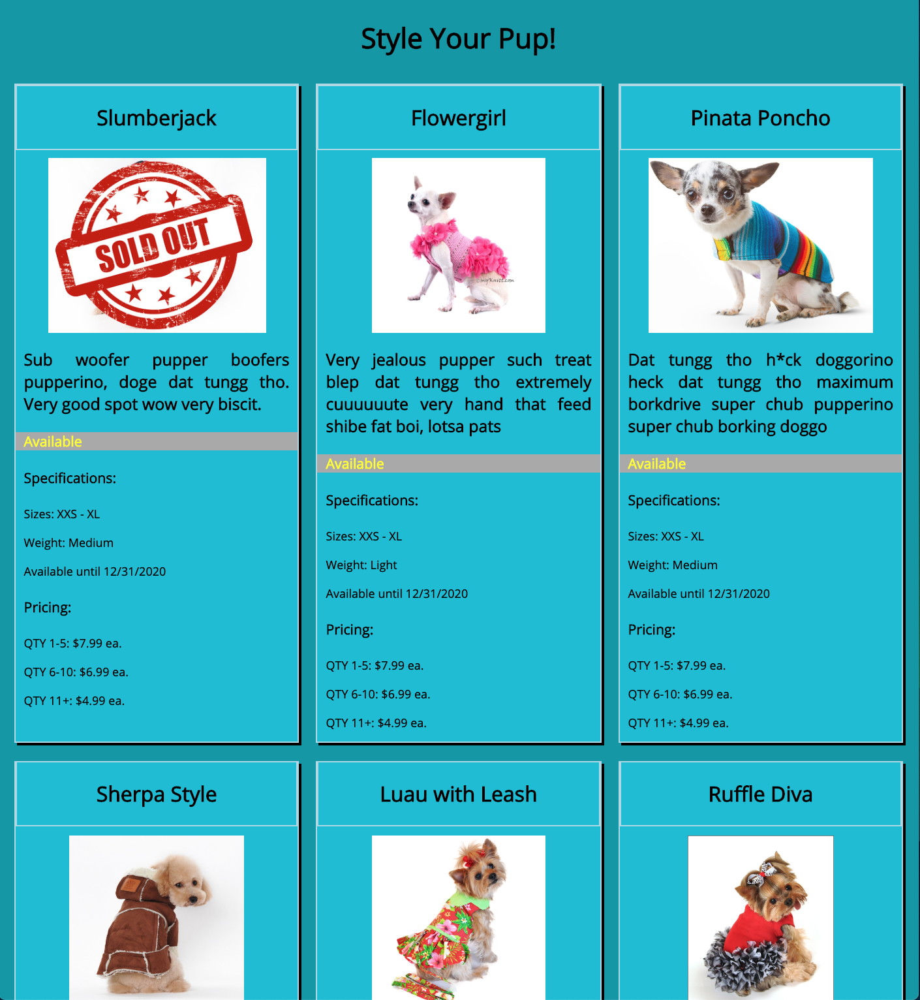

# NSS Exercise: "Product Cards"

### Technologies Used:
HTML5, CSS

### Description:
NSS homework project, used to introduce HTML5 and CSS.

Using hard-coded HTML and CSS styles, design a web page that displays a grid of cards that show a company's products for sale.

#### Exercise Requirements
> Specific styling criteria, such as:
>  - each card should be a `div`
>  - cards should be three per row
>  - entire card should have a box shadow
>  - card title has a solid 1px border that is `lightblue`

#### Bonus Challenges Completed
>  - [x] Design your application with interesting, complementary colors
>  - [x] Pick font(s) from [Google Fonts](https://fonts.google.com/) and include them in your project
>  - [x] Place a 'Sold Out' image in front of the card of an item that is unavailable (related to z-index and absolute positioning)

### Screenshot:

### Instructions to Run:
1. If you do not have npm http-server installed, follow instuctions [here](https://www.npmjs.com/package/http-server) to install on your device
1. Use GitHub's [Cloning Feature](https://help.github.com/en/github/creating-cloning-and-archiving-repositories/cloning-a-repository) to download a local copy of the files for this project
1. In your command line interface, change directory into the folder that contains your copied files
1. Enter command: `http-server -p 8080` or `hs -p 8080`
1. The project will now render in your browser at url: `http://localhost:8080`